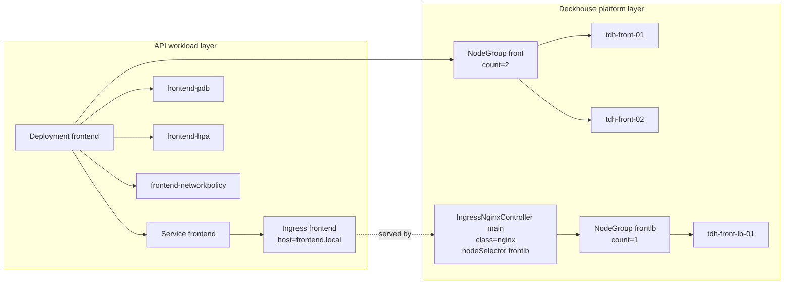

# Bare Metal Schema

## Scope

Этот файл описывает bare metal схему:
- `baremetal/config/*` (StaticInstance + NodeGroup + IngressNginxController)
- frontend workload слой (`Deployment/Service/Ingress/PDB/HPA/NetworkPolicy`)

## Platform + workload diagram (Mermaid)

## Related docs

- [BAREMETAL.md](BAREMETAL.md)
- [ingress.md](ingress.md)
- [project-schema.md](project-schema.md)
