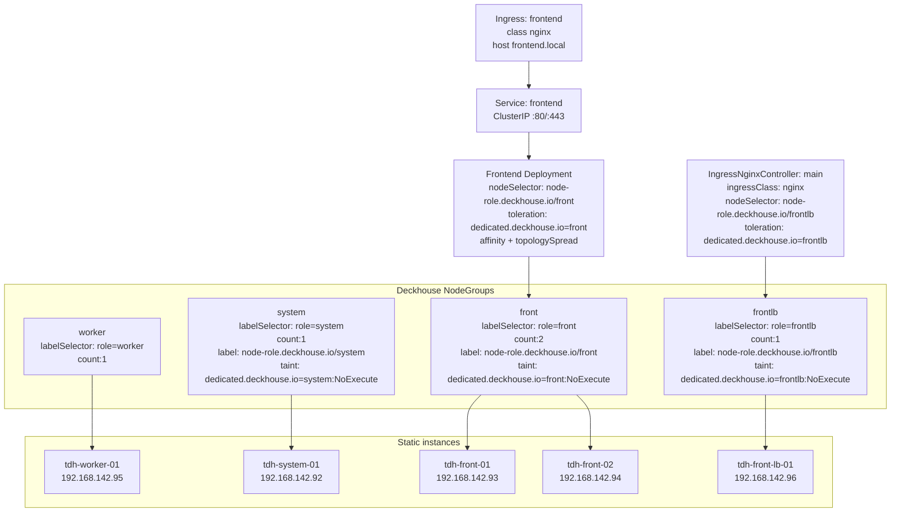
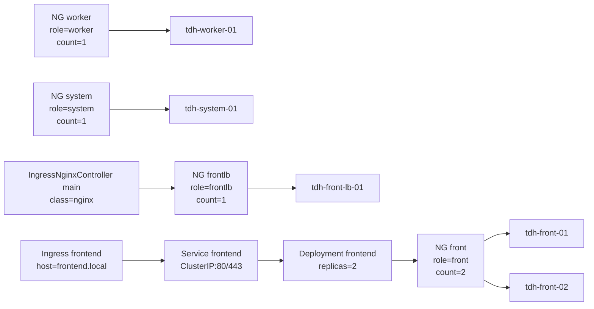

# Project Schema: Nodes → NodeGroups → Roles/Workloads

## Quick summary

- **NodeGroups**: `worker`, `system`, `front`, `frontlb`
- **Ingress controller** (`IngressNginxController/main`) закреплён на `frontlb`
- **Frontend workload** (пример `7_1-frontend-deployment.yml`) закреплён на `front`

## Deckhouse-first model

- **Platform (Deckhouse CRD, composition):** `StaticInstance` + `NodeGroup` + `IngressNginxController`.
- **Workloads (Kubernetes):** `Deployment` + `Service` + `Ingress` + `PDB` + `HPA` + `NetworkPolicy`.
- Операционный приоритет: сначала platform consistency, затем workload rollout.

## Topology diagram (Mermaid)

## Topology diagram (Mermaid, LR)

## NodeGroup to Node mapping

| NodeGroup | Role selector | Nodes | Purpose |
|---|---|---|---|
| `worker` | `role=worker` | `tdh-worker-01` | общие workload/system задачи |
| `system` | `role=system` | `tdh-system-01` | системные компоненты |
| `front` | `role=front` | `tdh-front-01`, `tdh-front-02` | frontend pods |
| `frontlb` | `role=frontlb` | `tdh-front-lb-01` | ingress controller |

## Key scheduling rules

- Ingress controller запускается только на `frontlb` через:
  - `nodeSelector: node-role.deckhouse.io/frontlb: ""`
  - `tolerations: dedicated.deckhouse.io=frontlb:NoExecute`
- Frontend deployment запускается только на `front` через:
  - `nodeSelector: node-role.deckhouse.io/front: ""`
  - `tolerations: dedicated.deckhouse.io=front:NoExecute`
  - `podAntiAffinity` + `topologySpreadConstraints`

## Production recommendations

1. **Ingress placement**
  - Текущая схема использует 1 `frontlb` ноду (`tdh-front-lb-01`) и 1 внешний IP.
  - Добавить `PodDisruptionBudget` для ingress-controller (`minAvailable: 1`).

2. **Frontend availability**
  - Увеличить `replicas` frontend до `>=3` при росте нагрузки.
  - Зафиксировать `podAntiAffinity` и `topologySpreadConstraints` как обязательные.
  - Добавить `PodDisruptionBudget` для frontend (`minAvailable: 1` или `maxUnavailable: 1`).

3. **Resources and autoscaling**
  - Задать реалистичные `requests/limits` для frontend и ingress.
  - Добавить `HorizontalPodAutoscaler` для frontend (по CPU/RPS).

4. **Security and hardening**
  - Добавить `NetworkPolicy` (разрешить только нужный east-west трафик).
  - Для frontend выставить `securityContext` (non-root, readOnlyRootFilesystem где возможно).

5. **Operational readiness**
  - Добавить readiness/liveness probes для frontend.
  - Вести алерты на недоступность ingress, рост 5xx, saturation CPU/memory на `front`/`frontlb`.

## Source files used

- `config/1-create-worker-ng.yml`
- `config/3-create-worker01.yml`
- `config/4-create-ng-system.yml`
- `config/4-create-no-system.yml`
- `config/5_1-create-ng-front.yml`
- `config/5_2-create-no-front-01.yml`
- `config/5_3-create-no-front-02.yml`
- `config/5_4-create-ng-front-lb.yml`
- `config/5_5-create-no-front-lb-01.yml`
- `config/6-create-ingress-nginx.yml`
- `config/7_1-frontend-deployment.yml`
- `config/7_2-frontend-service.yml`
- `config/7_3-frontend-ingress.yml`
- `config/7_4-frontend-pdb.yml`
- `config/7_5-frontend-hpa.yml`
- `config/7_6-frontend-networkpolicy.yml`
