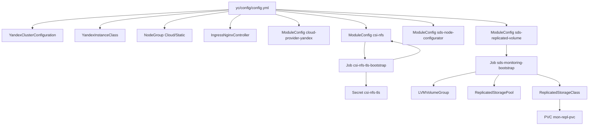

# YC Schema

## Scope

Этот файл описывает логическую схему YC-направления проекта:
- основной конфиг: `yc/config/config.yml`
- платформенные модули Deckhouse в YC
- storage/bootstrap/jobs в YC

## High-level diagram (Mermaid)

## Related docs

- [YC.md](YC.md)
- [Jobs mapping](JOBS.md)
